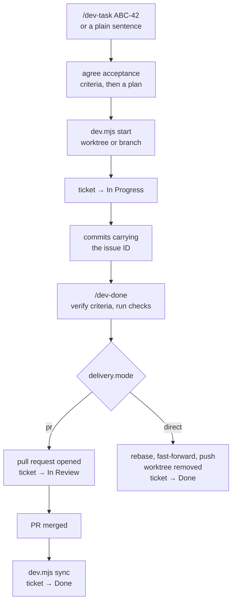
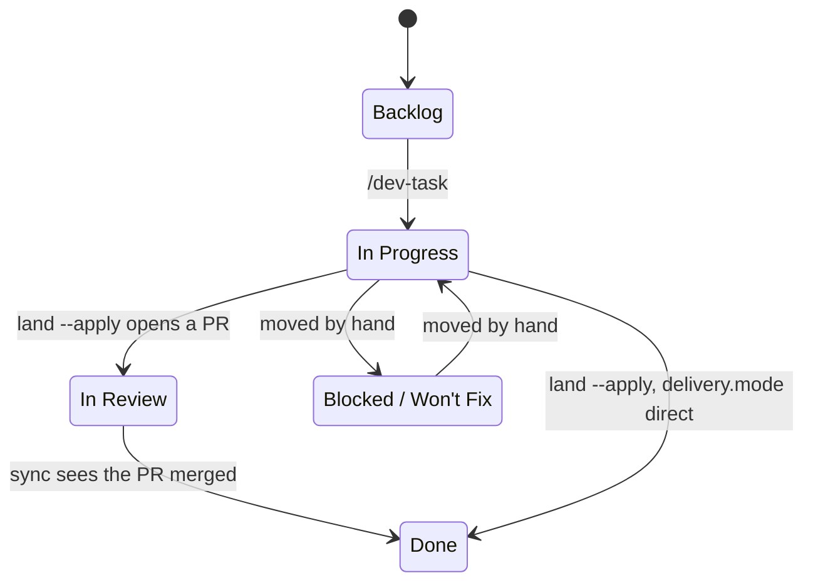

# dev-workflow

Ticket-driven development against your issue tracker — [YouTrack](https://www.jetbrains.com/youtrack/)
or [GitHub Issues](docs/configuration.md#github-issues) — as four Claude Code skills. It installs **per
project** — nothing is registered globally, so the skills exist only in repos that use a tracker.

| Skill         | What it does |
| ------------- | ------------ |
| `/dev-init`    | Probes the repo, asks what it cannot infer, verifies the credentials, writes `.dev-workflow.json`. |
| `/dev-task` | Takes an issue ID **or a plain sentence** — files the issue first when there is none — then agrees acceptance criteria, plans, moves it to *in progress*, checks it out in a worktree, and implements with ticket-referencing commits. |
| `/dev-bug`     | Investigates the likely code path, checks for duplicates, drafts the issue in the project's language, files it on approval. **Never fixes.** |
| `/dev-done`    | Re-reads the ticket, verifies each criterion with evidence, runs the checks, then lands the work the way the project delivers — pull request, or straight onto the base branch. |



Each ticket is checked out in its own git worktree by default, so starting one never disturbs
whatever is already in the tree. Whether finished work goes through a pull request or lands straight
on the base branch is **configuration, not a decision the model makes** — a solo project sets
`delivery.mode` to `direct` once and is never asked again.

Nothing installed is project-specific: instance, project, ticket language, repo layout, state
ladder, branch naming, isolation mode and commit convention all come from one
[`.dev-workflow.json`](docs/configuration.md) per project.

## Quick start

Node ≥ 22, and the project you want to set up. `jq` is needed by the commit hook, and the
[GitHub CLI](https://cli.github.com) by `dev.mjs sync` and by every GitHub Issues project. The
1Password CLI (`op`) is optional.

**YouTrack** — the wizard configures everything and verifies the token before writing a file:

```bash
cd your-project
npx claude-dev-workflow@latest
```

Have an instance URL and a token ready — *Profile → Account Security → Authentication → New token*,
`YouTrack` scope. Export it as `$YOUTRACK_TOKEN`, or give the wizard a 1Password reference.

**GitHub Issues** — install the files, then configure from inside a session. The wizard is
YouTrack-only and insists on an instance URL such a project does not have, so `--update` is the way
in: on a project with nothing installed it is a plain payload install that asks nothing.

```bash
cd your-project
npx claude-dev-workflow@latest --update
```

Then, in Claude Code, `/dev-init` — it knows about label ladders and writes the config.

Either way you now have the four skills. Start work:

```
/dev-task ABC-42
/dev-task the CSV export times out on big accounts     # no issue yet — it files one first
```

`/dev-task` agrees the acceptance criteria with you and waits for your approval on a plan before it
edits anything.

## Install

`npx claude-dev-workflow@latest` runs an interactive wizard
([`@clack/prompts`](https://github.com/bombshell-dev/clack)) that:

1. asks for the instance URL and where the token comes from — `$YOUTRACK_TOKEN` or a 1Password
   reference — and **verifies it before writing anything**;
2. lists the projects the token can see, so you pick one rather than typing a key;
3. reads that project's **real State / Type / Priority values** from the API, so the config can
   never name a state that does not exist;
4. scans the working tree for repos, package managers, test and lint scripts, commitlint types
   and scopes, runtime pins and git remotes, and shows them for confirmation;
5. infers whether issue IDs go at the prefix or suffix of a commit subject from the last 50
   commits;
6. writes `.dev-workflow.json` and installs the workflow into the project.

It works offline too — if the API is unreachable it says so and falls back to typed answers.

```bash
npx claude-dev-workflow@latest --dir ../other-project   # target somewhere else
npx claude-dev-workflow@latest --print                  # show the config, write nothing
npx claude-dev-workflow@latest --force                  # overwrite files you have edited
```

`npx github:ayhid/claude-dev-workflow` installs from `main`, one release ahead of npm and slower —
npm builds the repo's dev toolchain first. Prefer the registry unless you want unreleased work.
Cloned locally, `node bin/install.mjs` is the same thing again. Released versions are listed under
[Releases](https://github.com/ayhid/claude-dev-workflow/releases).

### What lands in the project

```
your-project/
  .dev-workflow.json              # your config — edit this
  _dev-workflow/                  # installer-managed runtime; commit it, do not edit
    scripts/  lib/  hooks/
    _config/manifest.json         # version + a sha256 per installed file
  .claude/
    skills/dev-task, dev-bug, dev-done, dev-init
    settings.json                 # the commit hook, merged in alongside your own
```

`_dev-workflow/` is meant to be committed: it is how your teammates get the same workflow without
installing anything. **The installed runtime has no dependencies of its own** — there is no
`node_modules` under it, so it works in a Python, Rust or Go project just as well.

## Updating

```bash
npx claude-dev-workflow@latest --update           # refresh the files, keep your config
npx claude-dev-workflow@latest --update --print   # show what would change, write nothing
npx claude-dev-workflow@latest --update --force   # …and overwrite files you have edited
```

`--update` skips the wizard entirely: it touches `_dev-workflow/`, `.claude/skills/dev-*` and the
hook entry in `.claude/settings.json`, and never reads or writes `.dev-workflow.json`.

The installer compares each file against the hash recorded at install time: untouched files are
replaced, files you have edited are reported and left alone, and files a newer version no longer
ships are removed. `--force` overrides that. Your `.claude/settings.json` is merged, never
overwritten — hooks you added yourself survive, and the entry is not duplicated on a re-run.

From inside an installed project:

```bash
node _dev-workflow/scripts/dev.mjs version      # installed vs latest, plus files you have edited
node _dev-workflow/scripts/dev.mjs version --upgrade
```

`version` is read-only and exits 0 even with no network — it prints `unknown` rather than failing.
`--upgrade` runs the `npx` line above for you, and refuses if `_dev-workflow/` or `.claude/skills/`
has uncommitted changes, because an update rewrites those files and you need the diff to be legible.

#### Why it must say `@latest`

npx keys its cache on the literal spec string and, on a re-run, only checks whether the tree it
already cached satisfies the range it recorded — `2.0.0` satisfies the `^2.0.0` it wrote — so a bare
`npx claude-dev-workflow` keeps re-running whatever version it saw first, indefinitely. `latest` is
a dist-tag, so it is re-resolved every time. The `github:` form is worse still: a git spec carries
no version to compare, so the cached clone is reused forever. Bust it by changing the spec —
`npx github:ayhid/claude-dev-workflow#v2.1.0`, or a commit sha — rather than by clearing the cache.
(`npx --ignore-existing` was removed in npm 7.)

## Configuration

`/dev-init` writes `.dev-workflow.json` at the repo root. It holds no secret — `tokenOpRef` is a
1Password *reference* — so it is meant to be committed.

**YouTrack** needs `baseUrl` and `project`; everything else has a working default.

```json
{
  "provider": "youtrack",
  "baseUrl": "https://acme.youtrack.cloud",
  "project": "ABC",
  "tokenOpRef": "op://Private/youtrack/credential",
  "states": { "start": "In Progress", "review": "In Review", "done": "Done" }
}
```

**GitHub Issues** has no state field, so the ladder is modelled with labels — which means the label
mapping and an explicit `states.ladder` are both required. Authentication is the GitHub CLI you
already have.

```json
{
  "provider": "github",
  "github": {
    "repo": "acme/api",
    "labels": {
      "In Progress": "status: in progress",
      "In Review": "status: review",
      "Done": "status: done"
    }
  },
  "states": {
    "ladder": ["Backlog", "In Progress", "In Review", "Done"],
    "start": "In Progress", "review": "In Review", "done": "Done"
  },
  "commit": { "idPattern": "#[0-9]+" }
}
```

**[Full configuration reference →](docs/configuration.md)** — every field, grouped by config block:
branch naming and worktrees, the commit convention the hook enforces, delivery modes, multi-repo
routing, credentials and environment overrides. Two worked examples live in
[`examples/`](examples/).

## Scripts

They are ordinary CLI tools; the skills just call them.

```bash
node _dev-workflow/scripts/dev.mjs config [--json]                       # effective config
node _dev-workflow/scripts/dev.mjs fetch  ABC-22                         # issue as markdown, comments included
node _dev-workflow/scripts/dev.mjs update ABC-22 state start             # move it along the ladder
node _dev-workflow/scripts/dev.mjs update ABC-22 state done @/tmp/c.md   # …with a comment (literal or @file)
node _dev-workflow/scripts/dev.mjs update ABC-22 comment "note"          # comment only
node _dev-workflow/scripts/dev.mjs create --dup-check "slug 500 router"  # open issues matching keywords
node _dev-workflow/scripts/dev.mjs create "Summary" @/tmp/body.md Bug Major   # prints the new ID on stdout
node _dev-workflow/scripts/dev.mjs start  ABC-22 [--type T] [--mode worktree|branch] [--repo PATH]
node _dev-workflow/scripts/dev.mjs start  ABC-22 --print                 # …just show the name and path
node _dev-workflow/scripts/dev.mjs land                                  # dry run: how this work would reach the base branch
node _dev-workflow/scripts/dev.mjs land --apply                          # open the PR, or rebase + fast-forward + push
node _dev-workflow/scripts/dev.mjs sync                                  # dry run: report state drift
node _dev-workflow/scripts/dev.mjs sync --apply --since 14d              # apply it, over a 14-day window
node _dev-workflow/scripts/dev.mjs sync --deep                           # also read commit subjects
node _dev-workflow/scripts/dev.mjs version                               # installed vs latest, and files you have edited
node _dev-workflow/scripts/dev.mjs version --upgrade                     # bring the payload up to date
```

`config`, `fetch`, `update` and `create` are plain HTTP. `start`, `land` and `sync` additionally
drive `git` and the GitHub CLI. None of them depend on anything outside Node's standard library,
which is what lets `_dev-workflow/` sit in a project of any language with nothing to install.

**`update` names the rung, not the state.** `state start`, `state review`, `state done` — the same
line works whether the backend moves a State field or swaps a label, so no session ever has to guess
a state name. An explicit ladder state is accepted too, and rejected before anything is sent if it
is not on the ladder. `update` writes to the issue tracker; `version` reports on — and optionally
updates — the workflow's own files. They are named a word apart on purpose: `upgrade` would have sat
one letter from `update` in the same command table, and a mistyped verb that rewrites 25 files
instead of moving a ticket is not a mistake worth making possible.

### `update … raw` (YouTrack only)

`update ABC-22 raw "Type Bug Priority Major"` sends a backend-native command. It is gated on the
provider's capabilities, so a GitHub project gets a usable error rather than a mystery. Two
behaviours worth knowing, both learned the hard way against the real API:

- The commands API returns **200 for commands it did not apply**. `dev.mjs update` always reads the
  state back afterwards and prints what it actually found — trust that line, not the exit code.
- Only values *containing a space* may be braced — braces mark where a multi-word value ends, they
  are not general quoting. Both directions bite: `Type {Bug} Priority {X}` parses as the single
  value `{Bug} Priority` and 400s, and `State {Staging}` is rejected outright with
  `expected: {Staging}`. Brace `{In Review}`, never `{Staging}`.

## Keeping states honest

Transitions rot. A PR merges on a Friday, nobody is in a session, and the ticket sits in review
until someone notices. The usual fix is a webhook that fires on merge — but an event that fires
while the runner is down is simply lost, and the ticket is wrong forever.

`dev.mjs sync` reconciles instead of reacting. It asks *given the PRs that exist right now, where
should each ticket be?* and advances whatever has fallen behind:

| Evidence | Target |
| --- | --- |
| an open PR references the issue | `states.review` |
| a merged PR references the issue | `states.done` |



It only ever moves **forward** along `states.ladder`, and never touches a state off the ladder — a
ticket parked in `Blocked` or `Won't Fix` was put there on purpose, and no reconciler should
second-guess that. Running it twice is a no-op, so it is safe from a hook, a cron, or the top of
`/dev-task`. Missing a week costs latency, nothing else.

It matches PRs to issues through the **branch name and PR title**. `--deep` additionally reads each
unmatched PR's commit subjects, which is where a `type(scope): description (ABC-1)` convention puts
the ID — slower, one extra API call per PR, but it finds work whose branch was named freehand.

Coverage is bounded by the convention, not the tool: a PR that names no issue anywhere is invisible
to it. If a run reports far fewer issues than you expect, that is the finding — the branch naming
has drifted, and the commit hook is what pulls it back.

Requires the [GitHub CLI](https://cli.github.com), authenticated. The repo is taken from
`repos[].github` when set, otherwise from the `upstream` then `origin` remote — set it explicitly
when branches live on a fork but PRs are opened against the parent.

## What the skills refuse to do

These are deliberate, and worth preserving in any fork:

- `/dev-bug` files and stops. It never starts the fix, edits a file or switches branch — the session
  may be mid-task on something else.
- `/dev-task` does not touch a file before the plan is approved, and does not close a ticket unasked.
- `/dev-done` refuses to close a ticket whose acceptance criteria are unmet or whose suite fails, and
  reports the gap instead.
- Nothing bypasses git hooks. No `--no-verify`, no `HUSKY=0`. `lib/vcs.mjs` refuses to build the
  argv, so it holds for code added later too.
- Nothing force-resolves a merge conflict. `-X theirs` and `checkout --theirs` discard one side
  silently; a rebase conflict aborts, leaves the branch untouched, and says which commits clashed.
- Nothing writes outside `_dev-workflow/` and `.claude/skills/dev-*`. That includes your
  `.gitignore`: worktree mode prints the line to add rather than adding it.

---

Changing this repo? See [CONTRIBUTING.md](CONTRIBUTING.md) for how to verify a write path, and
`CLAUDE.md` for the architecture.
