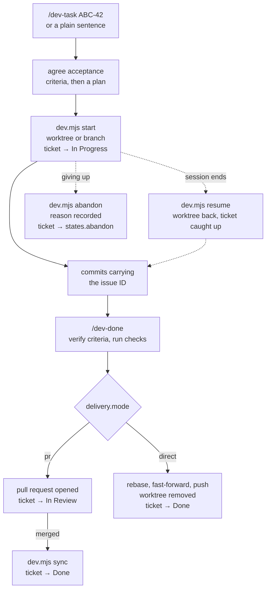
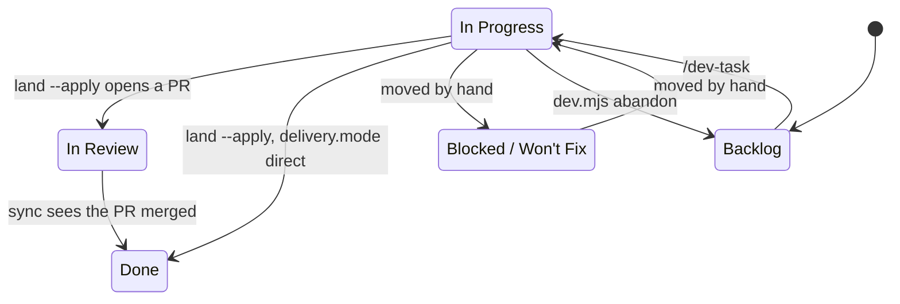

# dev-workflow

> Ticket-driven development for Claude Code, for teams and solo developers who already run their
> work through an issue tracker. Installed per project, tracker-agnostic (YouTrack or GitHub
> Issues), with no global state.

[](https://www.npmjs.com/package/claude-dev-workflow)
[](https://github.com/ayhid/claude-dev-workflow/actions/workflows/ci.yml)
[](https://nodejs.org)
[](LICENSE)


Ticket-driven development against your issue tracker, [YouTrack](https://www.jetbrains.com/youtrack/)
or [GitHub Issues](docs/configuration.md#github-issues), as six Claude Code skills. It installs **per
project**: nothing is registered globally, so the skills exist only in repos that use a tracker.

| Skill         | What it does |
| ------------- | ------------ |
| `/dev-init`    | Probes the repo, asks what it cannot infer, verifies the credentials, writes `.dev-workflow.json`. |
| `/dev-task` | Takes an issue ID **or a plain sentence**, files the issue first when there is none, then agrees acceptance criteria, plans, moves it to *in progress*, checks it out in a worktree, and implements with ticket-referencing commits. |
| `/dev-bug`     | Investigates the likely code path, checks for duplicates, drafts the issue in the project's language, files it on approval. **Never fixes.** |
| `/dev-done`    | Re-reads the ticket, verifies each criterion with evidence, runs the checks, then lands the work the way the project delivers: pull request, or straight onto the base branch. |
| `/dev-standup` | Everything in flight across every configured repo: what merged, what is checked out, what has stopped moving, and the one thing waiting on you. **Never writes.** |
| `/dev-ingest-docs` | Reads a brownfield project's existing documentation into a verified map: every claim anchored to the code that proves it, contradictions found, and the questions only a person can settle put to you. Runs in steps across sessions. **Never rewrites your docs.** |

Nothing installed is project-specific: instance, project, ticket language, repo layout, state
ladder, branch naming, isolation mode and commit convention all come from one
[`.dev-workflow.json`](docs/configuration.md) per project.

**Contents** &nbsp;
[Quick start](#quick-start) &middot;
[How a ticket flows](#how-a-ticket-flows) &middot;
[What the skills refuse to do](#what-the-skills-refuse-to-do) &middot;
[Install](#install) &middot;
[Updating](#updating) &middot;
[Configuration](#configuration) &middot;
[Scripts](#scripts) &middot;
[Keeping states honest](#keeping-states-honest) &middot;
[Joining an existing codebase](#joining-a-codebase-that-already-exists) &middot;
[Measuring what happened](#measuring-what-actually-happened)

## Quick start

Node ≥ 22, and the project you want to set up. `jq` is needed by the commit hook, and the
[GitHub CLI](https://cli.github.com) by `dev.mjs sync` and by every GitHub Issues project. The
1Password CLI (`op`) is optional.

One command for either tracker. The first question is which one you use, and that answer decides
every question after it:

```bash
cd your-project
npx claude-dev-workflow@latest
```

**GitHub Issues** needs no token — `gh` carries the authentication. The wizard proposes the
repository from your `origin` remote, checks that `gh` can write to it, and maps each rung of your
state ladder onto a label the repository really has. It never creates a label: anything missing is
printed as the exact `gh label create` command to run.

**YouTrack** needs an instance URL and a token: *Profile → Account Security → Authentication → New
token*, `YouTrack` scope. Export it as `$YOUTRACK_TOKEN`, or give the wizard a 1Password reference.
It then reads the project's real state, type and priority values off the API rather than proposing
names your instance may not have.

> [!TIP]
> The wizard never needs a token pasted into a file: give it a 1Password reference such as
> `op://Private/youtrack/credential` and it resolves through the `op` CLI at run time. It also
> works offline. If the API is unreachable it says so and falls back to typed answers.

To amend an existing config later, or to talk it through rather than click, run `/dev-init` in
Claude Code instead.

Either way you now have the six skills. Start work:

```
/dev-task ABC-42
/dev-task the CSV export times out on big accounts     # no issue yet, it files one first
```

`/dev-task` agrees the acceptance criteria with you and waits for your approval on a plan before it
edits anything.

## How a ticket flows



Each ticket is checked out in its own git worktree by default, so starting one never disturbs
whatever is already in the tree.

Not every ticket finishes, and not every session does either. `dev.mjs resume` puts a missing
worktree back and prints what the last session had actually left there — the uncommitted files by
name and the commits already made — then catches a ticket up to the start rung if it is behind.
`dev.mjs abandon` is the other way out: it records why on the ticket, moves it to `states.abandon`,
and takes the worktree and branch down. It refuses while there is anything to lose, so the reason
you gave is never the last trace of work you meant to keep.

> [!IMPORTANT]
> Whether finished work goes through a pull request or lands straight on the target branch is
> **configuration, not a decision the model makes**. A solo project sets `delivery.mode` to
> `direct` once and is never asked again.

Where it lands is configuration too. `delivery.base` is the branch work is delivered **onto**, and
`branch.base` the branch it is forked **from**; set the first only when they differ, and a project
can fork every ticket from `main` while merging into `develop` or a release branch.

## What the skills refuse to do

These are deliberate, and worth preserving in any fork.

| Guarantee | Enforced by |
| --- | --- |
| `/dev-bug` files and stops. It never starts the fix, edits a file or switches branch, because the session may be mid-task on something else. | The `/dev-bug` skill contract |
| `/dev-task` does not touch a file before the plan is approved, and does not close a ticket unasked. | The `/dev-task` skill contract |
| `/dev-done` refuses to close a ticket whose acceptance criteria are unmet or whose suite fails, and reports the gap instead. | The `/dev-done` skill contract |
| The transition log never leaves your machine, and never fails a ticket transition. | `dev.mjs` appends one JSON line locally; a log it cannot write produces a line on stderr and the ticket still moves. |
| `/dev-standup` reports and never writes — not even the `sync --apply` it suggests. A command run first thing in the morning must be safe to run without thinking. | `dev.mjs standup` has no write path at all; every fix it names is a command for you to approve. |
| `/dev-ingest-docs` never rewrites your documentation. It writes only under `_dev-workflow/artifacts/documentation/`; reorganising your docs is a proposal you approve as ordinary work. | The survey has no write path outside the payload root, and the map says it is generated. |
| An `observable` claim with no evidence anchor is refused, not stored. | `lib/ingest.mjs` — an unanchored claim is a guess in the voice of a fact, and a map of those reads exactly like one that was checked. |
| `dev.mjs abandon` refuses while the branch has uncommitted changes or commits the base has not seen, and names each one. `--force` is the only thing that discards them. | The check runs before the first write, so a refusal really does leave everything as it was found. |
| Nothing bypasses git hooks. No `--no-verify`, no `HUSKY=0`. | `lib/vcs.mjs` refuses to build the argv, so it holds for code added later too. |
| Nothing force-resolves a merge conflict. `-X theirs` and `checkout --theirs` discard one side silently. | A rebase conflict aborts, leaves the branch untouched, and says which commits clashed. |
| Nothing writes outside `_dev-workflow/` and `.claude/skills/dev-*`. That includes your `.gitignore`. | `isOwnedPath` in the installer; worktree mode prints the line to add rather than adding it. |

## Install

`npx claude-dev-workflow@latest` runs an interactive wizard
([`@clack/prompts`](https://github.com/bombshell-dev/clack)) that:

1. asks **which issue tracker the project uses**, first, because that answer decides every question
   after it — proposing GitHub Issues when `origin` points at github.com;
2. asks what that tracker needs and **verifies it before writing anything**: an instance URL and a
   token (`$YOUTRACK_TOKEN` or a 1Password reference) for YouTrack, a repository `gh` can write to
   for GitHub;
3. fills the rest from the tracker itself rather than proposing names it may not have — YouTrack's
   **real State / Type / Priority values** off the API, or the labels your GitHub repository really
   carries, mapped onto the rungs of your state ladder;
4. scans the working tree for repos, package managers, test and lint scripts, commitlint types
   and scopes, runtime pins and git remotes, and shows them for confirmation;
5. infers whether issue IDs go at the prefix or suffix of a commit subject from the last 50
   commits, in whichever ID shape that tracker uses;
6. writes `.dev-workflow.json` and installs the workflow into the project.

It never writes to your issue tracker. A GitHub ladder needs a label per rung, and any your
repository does not have yet are printed as the `gh label create` commands to run — adding a label
is a visible, permanent change to a repository, and not the installer's to make.

```bash
npx claude-dev-workflow@latest --dir ../other-project   # target somewhere else
npx claude-dev-workflow@latest --print                  # show the config, write nothing
npx claude-dev-workflow@latest --force                  # overwrite files you have edited
```

`npx github:ayhid/claude-dev-workflow` installs from `main`, one release ahead of npm and slower,
because npm builds the repo's dev toolchain first. Prefer the registry unless you want unreleased
work. Cloned locally, `node bin/install.mjs` is the same thing again. Released versions are listed
under [Releases](https://github.com/ayhid/claude-dev-workflow/releases).

> [!WARNING]
> **Always write `@latest`.** A bare `npx claude-dev-workflow` re-runs whatever version it first
> cached, indefinitely, and the `github:` form reuses its cached clone forever.

<details>
<summary>Why the <code>@latest</code> tag is load-bearing, and how to bust a stuck npx cache</summary>

npx keys its cache on the literal spec string and, on a re-run, only checks whether the tree it
already cached satisfies the range it recorded (`2.0.0` satisfies the `^2.0.0` it wrote), so a bare
`npx claude-dev-workflow` keeps re-running whatever version it saw first, indefinitely. `latest` is
a dist-tag, so it is re-resolved every time. The `github:` form is worse still: a git spec carries
no version to compare, so the cached clone is reused forever. Bust it by changing the spec,
`npx github:ayhid/claude-dev-workflow#v2.1.0` or a commit sha, rather than by clearing the cache.
(`npx --ignore-existing` was removed in npm 7.)

</details>

### What lands in the project

```
your-project/
  .dev-workflow.json              # your config, edit this
  _dev-workflow/                  # installer-managed runtime; commit it, do not edit
    scripts/  lib/  hooks/
    _config/manifest.json         # version + a sha256 per installed file
  .claude/
    skills/dev-task, dev-bug, dev-done, dev-init, dev-standup, dev-ingest-docs
    settings.json                 # the commit hook, merged in alongside your own
```

> [!IMPORTANT]
> **Commit `_dev-workflow/`, and never edit it.** Committing it is how your teammates get the same
> workflow without installing anything. Editing it makes the manifest treat the file as yours, so
> the next update silently skips it. **The installed runtime has no dependencies of its own**:
> there is no `node_modules` under it, so it works in a Python, Rust or Go project just as well.

## Updating

```bash
npx claude-dev-workflow@latest --update           # refresh the files, keep your config
npx claude-dev-workflow@latest --update --print   # show what would change, write nothing
npx claude-dev-workflow@latest --update --force   # and overwrite files you have edited
```

`--update` skips the wizard entirely: it touches `_dev-workflow/`, `.claude/skills/dev-*` and the
hook entry in `.claude/settings.json`, and never reads or writes `.dev-workflow.json`.

The installer compares each file against the hash recorded at install time: untouched files are
replaced, files you have edited are reported and left alone, and files a newer version no longer
ships are removed. `--force` overrides that. Your `.claude/settings.json` is merged, never
overwritten: hooks you added yourself survive, and the entry is not duplicated on a re-run.

### Checking a version from inside a project

```bash
node _dev-workflow/scripts/dev.mjs version      # installed vs latest, plus files you have edited
node _dev-workflow/scripts/dev.mjs version --upgrade
```

`version` is read-only and exits 0 even with no network: it prints `unknown` rather than failing.
`--upgrade` runs the `npx` line above for you, and refuses if `_dev-workflow/` or `.claude/skills/`
has uncommitted changes, because an update rewrites those files and you need the diff to be legible.

## Configuration

The wizard writes `.dev-workflow.json` at the repo root; `/dev-init` writes the same file from
inside a session.

> [!IMPORTANT]
> `.dev-workflow.json` holds no secret. `tokenOpRef` is a 1Password *reference*, not a credential,
> so the file is meant to be committed.

**YouTrack** needs `baseUrl` and `project`; everything else has a working default.

```json
{
  "provider": "youtrack",
  "baseUrl": "https://acme.youtrack.cloud",
  "project": "ABC",
  "tokenOpRef": "op://Private/youtrack/credential",
  "states": { "start": "In Progress", "review": "In Review", "done": "Done" }
}
```

**GitHub Issues** has no state field, so the ladder is modelled with labels, which means the label
mapping and an explicit `states.ladder` are both required. Authentication is the GitHub CLI you
already have.

```json
{
  "provider": "github",
  "github": {
    "repo": "acme/api",
    "labels": {
      "In Progress": "status: in progress",
      "In Review": "status: review",
      "Done": "status: done"
    }
  },
  "states": {
    "ladder": ["Backlog", "In Progress", "In Review", "Done"],
    "start": "In Progress", "review": "In Review", "done": "Done"
  }
}
```

**[Full configuration reference →](docs/configuration.md)** covers every field, grouped by config
block: branch naming and worktrees, the commit convention the hook enforces, delivery modes,
multi-repo routing, credentials and environment overrides. Two worked examples live in
[`examples/`](examples/).

## Scripts

They are ordinary CLI tools; the skills just call them. The three you will reach for by hand:

```bash
node _dev-workflow/scripts/dev.mjs standup                     # the whole board, in standup order
node _dev-workflow/scripts/dev.mjs start ABC-22                # branch or worktree, ticket to in progress
node _dev-workflow/scripts/dev.mjs sync                        # dry run: report state drift
```

> [!TIP]
> Nothing writes until you ask it to. `land` and `sync` are dry runs unless given `--apply`,
> `start --print` shows the branch name and path without creating anything, and the installer's
> `--print` prints the config it would write instead of writing it.

<details>
<summary>Full command reference: every <code>dev.mjs</code> subcommand and what each one needs</summary>

Each command below is prefixed with `node _dev-workflow/scripts/dev.mjs`.

| Command | What it does | Needs |
| --- | --- | --- |
| `config [--json]` | prints the effective config | HTTP only |
| `fetch ABC-22` | the issue as markdown, comments included | HTTP only |
| `update ABC-22 state start` | moves it along the ladder | HTTP only |
| `update ABC-22 state done @/tmp/c.md` | moves it, with a comment (literal or `@file`) | HTTP only |
| `update ABC-22 comment "note"` | comment only | HTTP only |
| `update ABC-22 raw "Type Bug Priority Major"` | a backend-native command, YouTrack only | HTTP only |
| `create --dup-check "slug 500 router"` | open issues matching keywords | HTTP only |
| `create "Summary" @/tmp/body.md Bug Major` | files the issue, prints the new ID on stdout | HTTP only |
| `start ABC-22 [--type T] [--mode worktree\|branch] [--repo PATH]` | branch or worktree, ticket to in progress | HTTP + git |
| `start ABC-22 --print` | just shows the name and path | git |
| `resume [ABC-22]` | worktree back, uncommitted files and commits so far, ticket caught up | HTTP + git |
| `resume ABC-22 --print` | the same report, repairing nothing | git |
| `abandon ABC-22 "why"` | records the reason, walks the ticket back, removes the worktree and branch | HTTP + git |
| `abandon ABC-22 "why" --force` | the same, discarding uncommitted changes and unmerged commits | HTTP + git |
| `land` | dry run: how this work would reach the base branch | git + GitHub CLI |
| `land --apply` | opens the PR, or rebase + fast-forward + push | git + GitHub CLI |
| `land --apply --criteria first-pass` | the same, recording whether the criteria passed first time | git + GitHub CLI |
| `assess` | greenfield or brownfield, proposed from signals | git |
| `ingest scan` \| `next` \| `read` \| `record` \| `answer` \| `emit` | absorb existing documentation, one step at a time | git |
| `standup [--since 3d] [--stale 7d]` | what merged, what is in flight, what is stale, what is next | HTTP + git + GitHub CLI |
| `sync` | dry run: report state drift | git + GitHub CLI |
| `sync --apply --since 14d` | applies it, over a 14-day window | HTTP + git + GitHub CLI |
| `sync --deep` | also reads commit subjects | git + GitHub CLI |
| `status` | this checkout: branch, ticket, state, PR, dirty files, next step | git + GitHub CLI |
| `status --all` | every worktree and ticket in flight, across configured repos | git + GitHub CLI |
| `note "what you learned"` | appends it to the project's notes file, tagged with the current ticket | nothing |
| `note @/tmp/longer.md` | the same, from a file | nothing |
| `note` | where notes live and how many there are | nothing |
| `version` | installed vs latest, and files you have edited | HTTP only |
| `version --upgrade` | brings the payload up to date | git |

`config`, `fetch`, `update` and `create` are plain HTTP. `start`, `resume`, `abandon`, `land`,
`standup` and `sync` additionally drive `git`, and `land`, `standup` and `sync` the GitHub CLI —
`standup` degrading to the git half rather than refusing when it is missing.

None of them depend on anything outside Node's standard library,
which is what lets `_dev-workflow/` sit in a project of any language with nothing to install.

</details>

**`update` names the rung, not the state.** `state start`, `state review`, `state done`,
`state abandon`: the same
line works whether the backend moves a State field or swaps a label, so no session ever has to guess
a state name. An explicit ladder state is accepted too, and rejected before anything is sent if it
is not on the ladder. `update` writes to the issue tracker; `version` reports on, and optionally
updates, the workflow's own files. They are named a word apart on purpose: `upgrade` would have sat
one letter from `update` in the same command table, and a mistyped verb that rewrites 25 files
instead of moving a ticket is not a mistake worth making possible.

### `update … raw` (YouTrack only)

`update ABC-22 raw "Type Bug Priority Major"` sends a backend-native command. It is gated on the
provider's capabilities, so a GitHub project gets a usable error rather than a mystery.

> [!CAUTION]
> Two behaviours worth knowing, both learned the hard way against the real API:
>
> - The commands API returns **200 for commands it did not apply**. `dev.mjs update` always reads
>   the state back afterwards and prints what it actually found. Trust that line, not the exit code.
> - Only values *containing a space* may be braced. Braces mark where a multi-word value ends, they
>   are not general quoting. Both directions bite: `Type {Bug} Priority {X}` parses as the single
>   value `{Bug} Priority` and 400s, and `State {Staging}` is rejected outright with
>   `expected: {Staging}`. Brace `{In Review}`, never `{Staging}`.

## Keeping states honest

Transitions rot. A PR merges on a Friday, nobody is in a session, and the ticket sits in review
until someone notices. The usual fix is a webhook that fires on merge, but an event that fires
while the runner is down is simply lost, and the ticket is wrong forever.

`dev.mjs sync` reconciles instead of reacting. It asks *given the PRs that exist right now, where
should each ticket be?* and advances whatever has fallen behind:

| Evidence | Target |
| --- | --- |
| an open PR references the issue | `states.review` |
| a merged PR references the issue | `states.done` |



The reconciler is what makes that one-way. `abandon` is the only thing in the tool that walks a
ticket **back**, which is why the state it walks back to is required configuration
(`states.abandon`) rather than a guess: nothing else will notice a wrong one. It does not touch
pull requests either — an open PR still referencing the ticket will pull it forward to the review
rung on the next run, so close the PR too, or the walk-back does not stick.

It only ever moves **forward** along `states.ladder`, and never touches a state off the ladder: a
ticket parked in `Blocked` or `Won't Fix` was put there on purpose, and no reconciler should
second-guess that. Running it twice is a no-op, so it is safe from a hook, a cron, or the top of
`/dev-task`. Missing a week costs latency, nothing else.

It matches PRs to issues through the **branch name and PR title**. `--deep` additionally reads each
unmatched PR's commit subjects, which is where a `type(scope): description (ABC-1)` convention puts
the ID. That is slower, one extra API call per PR, but it finds work whose branch was named
freehand.

Coverage is bounded by the convention, not the tool: a PR that names no issue anywhere is invisible
to it. If a run reports far fewer issues than you expect, that is the finding. The branch naming
has drifted, and the commit hook is what pulls it back.

Requires the [GitHub CLI](https://cli.github.com), authenticated. The repo is taken from
`repos[].github` when set, otherwise from the `upstream` then `origin` remote. Set it explicitly
when branches live on a fork but PRs are opened against the parent.

## Joining a codebase that already exists

Most projects are not greenfield. There are years of decisions in them, some written down, and some
of those no longer true — and the expensive failure is a session confidently reimplementing
something that is already there.

```bash
node _dev-workflow/scripts/dev.mjs assess     # greenfield or brownfield, with every signal shown
```

It proposes and never decides; you confirm, and the answer is recorded as `stage`.

On a brownfield project, `/dev-ingest-docs` then reads the existing documentation into something a
later session can trust. The unit is a **claim**, not a document, and every claim carries its
evidence:

- **`observable`** — checkable against the tree, and **required to carry an anchor** (`file:line`,
  or the command that shows it). Two of these disagreeing is a contradiction you can locate.
- **`intent`** — why something is the way it is. No amount of reading settles a disagreement between
  two of these, so those are the questions that get put to you.

That split is what keeps arbitration small enough to survive: the tool asks about what evidence
genuinely cannot settle, and nothing else. It runs **in steps across sessions** — every claim,
question and answer is persisted, so a survey can be picked up next week, and a colleague who pulls
gets the decisions and not just the map.

It writes to `_dev-workflow/artifacts/documentation/` and nowhere else. Reorganising your own docs
is a proposal it hands you, not an edit it makes.

## Measuring what actually happened

Nothing in a workflow like this remembers. A ticket takes three days or three weeks, gets restarted
twice, closes with its criteria met on the first pass or the fourth — and none of it survives the
session that did the work.

So every transition to **start**, **done** or **abandon** appends one JSON line to
`.dev-workflow.metrics.jsonl`, beside your config:

```json
{"at":"2026-08-29T16:20:11.412Z","event":"done","id":"#28","state":"Done","provider":"github","elapsedMs":198011412,"starts":2,"criteria":"first-pass"}
```

It is **local**: no network, no telemetry, nothing sent anywhere, and it holds no secret.
`"metrics": false` turns it off. Abandoned tickets are recorded like finished ones, because a log
that counts only successes answers a question nobody asked, and `starts` is named after what it can
actually see — restarts, not test runs.

Two properties are deliberate. It hangs off **one wrapper** around `setState`, so every command that
moves a ticket is instrumented and none of them knows the log exists. And it can never fail a
command: an unwritable or half-written log produces a line on stderr and the ticket still moves.

[Format and fields](docs/configuration.md#metrics--the-transition-log) &middot;
**Add it to your `.gitignore`** — every developer appends to it, so a shared copy conflicts on every
merge. The workflow says so the first time it writes the file rather than editing your `.gitignore`.

---

Changing this repo? See [CONTRIBUTING.md](CONTRIBUTING.md) for how to verify a write path, and
`CLAUDE.md` for the architecture.
